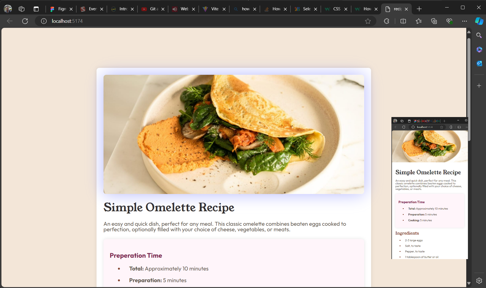

# Frontend Mentor - Recipe page solution

This is a solution to the [Recipe page challenge on Frontend Mentor](https://www.frontendmentor.io/challenges/recipe-page-KiTsR8QQKm). Frontend Mentor challenges help you improve your coding skills by building realistic projects.

## Table of contents

- [Overview](#overview)
  - [The challenge](#the-challenge)
  - [Screenshot](#screenshot)
  - [Links](#links)
- [My process](#my-process)
  - [Built with](#built-with)
  - [What I learned](#what-i-learned)
  - [Continued development](#continued-development)
  - [Useful resources](#useful-resources)
- [Author](#author)

## Overview

to build out this recipe page and get it looking as close to the design as possible, I used html, css, imported fonts, and responsive media styling via the @media css media query technique to get it looking as close to the design as possible.

### Screenshot



### Links

- Solution URL: [Add solution URL here](https://your-solution-url.com)
- Live Site URL: [Add live site URL here](https://your-live-site-url.com)

## My process

my procce was to scetch out a template on papper 1st, then build out that tamplate without using the style sheet 2nd, then lato end I replaced my initial ruff template colors with the percise directives from the style sheet plus added any details that where missed with one to one comparison to the provided examples to finish.

### Built with

- Semantic HTML5 markup
- CSS custom properties
- [vite](https://vitejs.dev/)
- [React](https://reactjs.org/)
- [Node.js](https://nodejs.org/)
- imported fonts provided

# React + Vite

This template provides a minimal setup to get React working in Vite with HMR and some ESLint rules.

Currently, two official plugins are available:

- [@vitejs/plugin-react](https://github.com/vitejs/vite-plugin-react/blob/main/packages/plugin-react/README.md) uses [Babel](https://babeljs.io/) for Fast Refresh
- [@vitejs/plugin-react-swc](https://github.com/vitejs/vite-plugin-react-swc) uses [SWC](https://swc.rs/) for Fast Refresh

### What I learned

submiting these projects is keeping me familiar with use of git local & cloud shared, plus keeping me familiar with markdown.

I have not used a local file to host a font type in a project in a project outside of school, so the prevition of .ttf files for this project gave me the oportunity to lookup and reviw how I would go about that if I wanted to do so instead of import or link the files via the web.

Also, The repetative use of both a html 'class=' identifier and a html 'id=' identifier made it simpler for me to target a style to a very specific section from the css style sheet for this project

for example in the html seen below:

```html
<div class="card" id="preperation">
  <h3>Preperation Time</h3>
  <ul>
    <li>
      <p><b>Total:</b> Approximately 10 minutes</p>
    </li>
  </ul>
</div>
```

I was also proud of the CSS implemented below to hide a image at different sizes using the @media query

```css
#containedWidth {
  display: none;
}
img {
  display: flex;
  width: 100%;
  height: auto;
}
@media screen and (min-width: 475px) {
}
#fullWidth {
  display: none;
}
#containedWidth {
  display: flex;
}
img {
  width: 100%;
  height: auto;
  border-radius: 8px;
}
```

### Continued development

I noticed my list item bullet points where not as far justified left as what was shown in the example image. I will be looking into how to shift there placing beyond having no margin or padding to get this effect if a so choose, but for now I was stumpped.

Also, depite understanding how to use the @Media query technique for respove changes okay, I'm wondering if ther is any industry standards or go to templates for this specific query when it comes to common contatiners or web themes that I learn or save so I am more confident my chosen settings are good.

### Useful resources

- [www.w3schools.com](https://www.w3schools.com/) - w3schools has been my goto resource to brush up or explore ideas when coding. In this project this resource helped me to set a css color to a 'hr' line break with example of how to target the "border" element.
- [stackoverflow.com](https://stackoverflow.com/) - stackoverflow is my second biggest go to sight when searching for ideas, This is always great, and in this project I used it to look up how to host a font from a local file if needed.

## Author

Noble A.

- Frontend Mentor - [@NobleAxiom](https://www.frontendmentor.io/profile/NobleAxiom)
